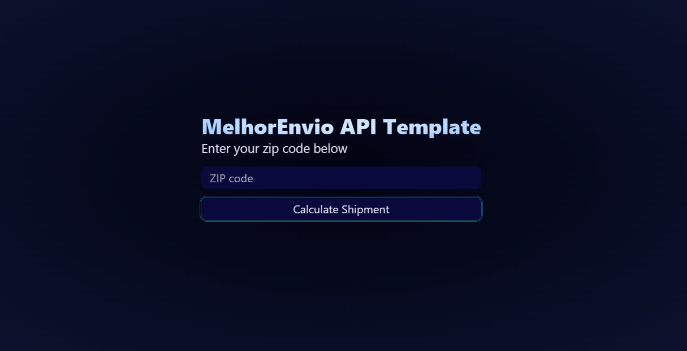

# melhor-envio-template

## 🔥 Features

- Real Cep (Zip code | Postal) code Validation with API <a href="viacep.com.br">ViaCep</a>;
- MelhorEnvio API;
    - Cep (Zip code | Postal) code calculation;
    - Create a postal billet on the plataform;
- <a href="https://github.com/jquense/yup">Yup</a> Schema validation;
- <a href="https://react-hook-form.com">React-Hook-Form</a>;
    - Form validation;
    - Error handlers;
- ChakraUI for UI elements;
